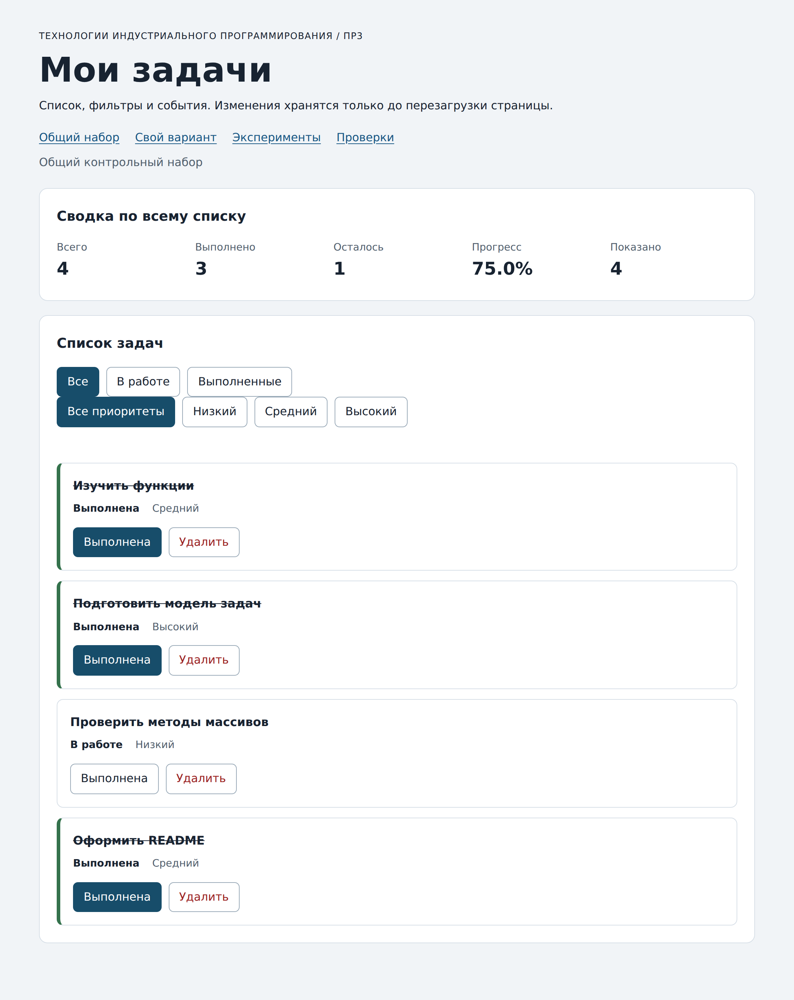

# Практическая работа № 3. Работа с DOM и событиями

## Данные работы

| Поле | Значение |
|---|---|
| Имя | Никита Бочко |
| Группа | ЭФБО-05-25 |
| Вариант из ПР2 | 3, создание сайта-портфолио |
| Node.js | v22.23.2 |
| Браузер | Chromium 141.0.7390.37 |
| Операционная система | macOS |

## Запуск

Рабочая папка: `practice-03` внутри личного репозитория.

```bash
npm run check:service
npm start
```

Зависимостей нет, `npm install` не нужен. Адреса:

```text
http://127.0.0.1:5503/
http://127.0.0.1:5503/index.html?dataset=variant
http://127.0.0.1:5503/examples/dom-events.html
http://127.0.0.1:5503/checks.html
```

Остановка сервера: `Ctrl+C`. Порт по умолчанию 5503, при занятом порте запускается `node tools/serve.mjs 5504`.

## Что перенесено из ПР2

`src/task-service.js` и `src/data.js` скопированы из `practice-02` без правок: девять функций и набор варианта 3 остались теми же. Исправлять ничего не пришлось, `npm run check:service` на копии внутри ПР3 сразу дал 35 из 35. `main.js` из ПР2 не переносил, он там был консольным сценарием, а здесь управляет интерфейсом.

## Эксперименты

| № | До запуска: прогноз | После запуска: результат | Объяснение |
|---:|---|---|---|
| 1. Отсутствующий элемент и коллекция | `null` и ошибка при обращении к длине | `Отсутствующий элемент: null`, `Пустая коллекция: 0` | `querySelector` при промахе даёт `null`, а `querySelectorAll` - пустой `NodeList`, у которого `length` равен нулю. Ошибка будет не на длине коллекции, а на обращении к свойству `null` |
| 2. dataset и числовой id | `23` и `23`, оба числа | `dataset.taskId: 23 string`, `Числовой id: 23` | В `dataset` любое значение лежит строкой, число получается только после `Number()`. Поэтому в обработчике идентификатор преобразуется явно |
| 3. Статический NodeList | после двух нажатий обе величины станут `3` | старый `NodeList` остался `1`, новый запрос дал `2`, затем `3` | Коллекция из `querySelectorAll` - снимок на момент вызова. Новые узлы в неё не попадают, нужен новый запрос |
| 4. Строка с HTML-разметкой | слово «Это» станет жирным | `<strong>Это текст, а не HTML</strong>`, вложенных элементов 0 | `textContent` пишет строку как текст, теги не разбираются. Это и защищает список задач от разметки в названии |
| 5. Распространение события | один вызов, на самой кнопке | три записи: `phase=1 currentTarget=lab-card`, `phase=3 currentTarget=lab-button`, `phase=3 currentTarget=lab-card` | Нажатие пришлось на вложенный `span`, поэтому `target` во всех трёх записях `lab-label`. Сначала срабатывает перехватчик контейнера на фазе захвата, потом обработчики поднимаются вверх: кнопка, затем контейнер |

Пятый эксперимент и объясняет, почему обработчик контейнера ловит нажатие на вложенный элемент: событие идёт от корня к цели и обратно, и обработчик на родителе вызывается на обратном пути. На этом и построено делегирование в `main.js`: один слушатель на `ul#task-list` вместо двух слушателей на каждой карточке.

## Организация кода

`task-service.js` - перенесённые функции ПР2, про DOM ничего не знает. `task-selectors.js` считает выборку: `getVisibleTasks` по статусу и `getTasksByPriority` для расширения, обе возвращают новый массив. `task-view.js` создаёт карточки и обновляет сводку со списком, но не трогает данные и не вешает обработчики. `main.js` хранит состояние и связывает всё вместе.

Полный список лежит в `currentTasks` внутри `main.js`, фильтры - в `currentFilter` и `currentPriority`. Событие обрабатывается одним делегированным слушателем на `ul#task-list` и по одному на каждой группе кнопок фильтра. Сводка считается через `getTaskStats(currentTasks)` в `renderSummary`, то есть по всему массиву, а не по карточкам в DOM: поэтому при фильтре «В работе» прогресс остаётся прежним, меняется только «Показано».

## Общий сценарий

| Шаг | Видимые id | Всего | Выполнено | Осталось | Прогресс | Показано | Сообщение | Совпало с ожиданием |
|---:|---|---:|---:|---:|---|---:|---|---|
| 0. Исходный набор, «Все» | `[1, 4, 7, 10]` | 4 | 2 | 2 | `50.0%` | 4 | нет | да |
| 1. Фильтр «В работе» | `[4, 7]` | 4 | 2 | 2 | `50.0%` | 2 | нет | да |
| 2. Выполнить `id = 4` | `[7]` | 4 | 3 | 1 | `75.0%` | 1 | нет | да |
| 3. Фильтр «Все» | `[1, 4, 7, 10]` | 4 | 3 | 1 | `75.0%` | 4 | нет | да |
| 4. Удалить `id = 7` | `[1, 4, 10]` | 3 | 3 | 0 | `100.0%` | 3 | нет | да |
| 5. Фильтр «В работе» | `[]` | 3 | 3 | 0 | `100.0%` | 0 | `Нет задач по выбранному фильтру.` | да |
| 6. «Все», переключить `id = 1` | `[1, 4, 10]` | 3 | 2 | 1 | `66.7%` | 3 | нет | да |
| 7. Удалить `1`, `4`, `10` | `[]` | 0 | 0 | 0 | `0.0%` | 0 | `Список задач пуст.` | да |

После перезагрузки страница возвращается к шагу 0: четыре задачи, `50.0%`. Ничего не сохраняется, потому что состояние живёт в переменной модуля, а `demoTasks` при старте копируется через `map` со spread. Сохранение между перезагрузками - тема ПР4.

Шаги 5 и 7 дают разные пустые состояния, и это видно по тексту сообщения: на шаге 5 задачи есть, но ни одна не подходит под фильтр, на шаге 7 список пуст полностью.

## Индивидуальный вариант

Тема варианта 3 - создание сайта-портфолио. Шесть задач: `11` собрать список работ (высокий, выполнена), `23` выбрать шаблон и цветовую схему (средний, выполнена), `37` свёрстать главную страницу (высокий), `41` добавить раздел с проектами (средний), `58` написать текст о себе (низкий), `64` опубликовать сайт на GitHub Pages (низкий). Открывается по адресу с `?dataset=variant`.

| Этап | Всего | Выполнено | Осталось | Прогресс | Видимые id |
|---|---:|---:|---:|---|---|
| До действий | 6 | 2 | 4 | `33.3%` | `[11, 23, 37, 41, 58, 64]` |
| После переключения 23 | 6 | 1 | 5 | `16.7%` | `[11, 23, 37, 41, 58, 64]` |
| После удаления 37 | 5 | 1 | 4 | `20.0%` | `[11, 23, 41, 58, 64]` |
| Итог, фильтр «В работе» | 5 | 1 | 4 | `20.0%` | `[23, 41, 58, 64]` |
| Итог, фильтр «Выполненные» | 5 | 1 | 4 | `20.0%` | `[11]` |

Совпало с контрольными значениями методички: после двух действий выполнена одна задача, итоговый прогресс `20.0%`, оставшиеся идентификаторы `[11, 23, 41, 58, 64]`. Переключение `id = 23` снимает отметку, потому что кнопка передаёт в `setTaskCompleted` значение, обратное текущему, а не всегда `true`. Названия и приоритеты остальных записей не изменились.

## Протокол проверки сервиса

```text
OK: 01. Создание задачи с явным приоритетом
OK: 02. Приоритет по умолчанию
OK: 03. Удаление краевых пробелов без изменения внутренних
OK: 04. Граничные длины названия и положительный безопасный id
OK: 05. Некорректные названия при создании
OK: 06. Некорректные идентификаторы при создании
OK: 07. Все допустимые приоритеты и отклонение недопустимых
OK: 08. Каждый вызов createTask возвращает новый объект
OK: 09. Поиск по id, а не по индексу
OK: 10. Отсутствующая задача и пустой массив при поиске
OK: 11. Поиск не преобразует строковый id в число
OK: 12. Получение невыполненных задач
OK: 13. Пустой список, все выполнены и все не выполнены
OK: 14. Названия в исходном порядке и пустой список
OK: 15. Сводка по общему набору
OK: 16. Сводка по пустому списку
OK: 17. Сводка: ничего не выполнено и выполнено всё
OK: 18. Процент остаётся числом без предварительного округления
OK: 19. Добавление в конец без изменения входного массива
OK: 20. Добавление в пустой список с приоритетом по умолчанию
OK: 21. Повторяющийся id отклоняется
OK: 22. Добавление не обходит проверки createTask
OK: 23. Изменение completed в обе стороны
OK: 24. completed принимает только boolean
OK: 25. Некорректный или отсутствующий id при изменении статуса
OK: 26. Повторная установка статуса создаёт новый результат
OK: 27. Переименование сохраняет остальные поля
OK: 28. Проверки названия при переименовании
OK: 29. Некорректный или отсутствующий id при переименовании
OK: 30. Удаление по id с сохранением порядка
OK: 31. Удаление единственной записи
OK: 32. Некорректный, отсутствующий id и удаление из пустого списка
OK: 33. Входные объекты не изменяются ни одной операцией
OK: 34. Общий сценарий и все промежуточные сводки
OK: 35. Работа с другим набором, без зависимости от demoTasks

Проверок пройдено: 35; не пройдено: 0.
```

## Протокол браузерных проверок

Текстовый протокол со страницы `checks.html`:

```text
OK: Фильтр all возвращает новый массив в исходном порядке
OK: Фильтр pending выбирает невыполненные задачи
OK: Фильтр completed выбирает выполненные задачи
OK: Все три фильтра работают с пустым списком
OK: Фильтрация не меняет входные записи и их порядок
OK: Карточка — li.task-card с числовым id в dataset
OK: Статус невыполненной карточки и aria-pressed согласованы
OK: Статус выполненной карточки и aria-pressed согласованы
OK: В карточке две обычные кнопки с вложенными подписями
OK: Все приоритеты отображаются по установленному словарю
OK: Название с разметкой отображается текстом
OK: Отрисовка списка создаёт карточки в исходном порядке
OK: Повторная отрисовка не накапливает карточки
OK: Контейнер списка и его обработчик сохраняются
OK: Отрисовка пустого массива очищает прежние карточки
OK: Сводка считается по всему списку, отдельно выводится Показано
OK: Пустая сводка не содержит NaN и Infinity
OK: Сообщение для полностью пустого списка
OK: Сообщение для пустого результата фильтра
OK: Появление карточек скрывает прежнее пустое состояние
OK: Приложение: начальный набор и сводка
OK: Приложение: фильтр срабатывает по клику на вложенный span
OK: Приложение: активный фильтр отмечен классом и aria-pressed
OK: Приложение: фильтрация не удаляет скрытые задачи
OK: Приложение: переключение по id, а не индексу массива
OK: Приложение: выполненная задача исчезает из фильтра В работе
OK: Приложение: удаление изменяет данные, а не только DOM
OK: Приложение: клик по названию не изменяет данные
OK: Приложение: после перерисовок одно нажатие — одно изменение
OK: Приложение: удаление всех записей и нулевая сводка
OK: Приложение: нет совпадений — не то же самое, что нет задач
OK: Приложение: неизвестный числовой id не меняет данные
OK: Приложение: id 4abc не превращается в 4
OK: Приложение: неизвестное действие игнорируется
OK: Приложение: после изменения сохраняется клавиатурный фокус
OK: Приложение: новая загрузка возвращает исходное состояние

Всего: 36. Пройдено: 36. Ошибок: 0.
```

Длинные тире в названиях проверок оставлены как есть: это дословный текст готового протокола, а не мой.

## Собственные проверки

| № | Исходное состояние и действия | Ожидаемый результат | Фактический результат | Итог |
|---:|---|---|---|---|
| 1. Граничное состояние: пустой список против пустого фильтра | Общий набор, удалить все четыре задачи, затем нажать «В работе» | Сводка из нулей и `0.0%`, сообщение `Список задач пуст.` не подменяется текстом про фильтр | Всего 0, выполнено 0, осталось 0, прогресс `0.0%`, показано 0, сообщение `Список задач пуст.` | Пройдено |
| 2. Повторная отрисовка не плодит обработчики | Общий набор, шесть переключений фильтров подряд, затем одно нажатие «Выполнена» у `id = 4` | Ровно одно изменение: выполнено 3, прогресс `75.0%` | Всего 4, выполнено 3, осталось 1, прогресс `75.0%`, показано 4 | Пройдено |
| 3. Подменённый идентификатор карточки | Через панель Elements заменить `data-task-id` у карточки `id = 4` сначала на `777`, затем на `4abc`, каждый раз нажать кнопку | Оба раза непустое сообщение, данные не меняются | `Задача с идентификатором 777 не найдена`, затем `Некорректный идентификатор задачи: 4abc`; сводка в обоих случаях осталась 4 / 2 / 2 / `50.0%` | Пройдено |
| 4. Клавиатура вместо мыши | Фокус на кнопке «Выполнена» у `id = 4`, нажать Enter, затем Space; потом Enter на «Удалить» у `id = 7` | Enter и Space срабатывают как клик, после удаления фокус уходит на активный фильтр | После Enter 4 / 3 / 1 / `75.0%`, после Space обратно 4 / 2 / 2 / `50.0%`, фокус остался на кнопке карточки `4`; после удаления `id = 7` стало 3 / 2 / 1 / `66.7%`, фокус на кнопке «Все» | Пройдено |

Третий случай показателен: `Number("4abc")` даёт `NaN`, поэтому проверка `Number.isSafeInteger` отсекает такой идентификатор до вызова сервиса, а `777` проходит проверку формата, но не находится в массиве, и отказ приходит уже из `removeTask`. Сообщения разные, и это правильно: причины отказа разные.

## Отладка и клавиатура

Точка останова ставится в `handleTaskListClick` на строке `const id = Number(card.dataset.taskId);`. При нажатии на подпись кнопки «Выполнена» у задачи `id = 4` в Scope видно: `event.target` - это `span.action-label`, `event.currentTarget` - `ul#task-list`, то есть цель и элемент с обработчиком разные; `card.dataset.taskId` равно строке `"4"`, после `Number()` получается число `4`, `action` равен `"toggle"`, найденная через `findTaskById` запись имеет `completed: false`.

На следующем шаге видно результат сервиса: `setTaskCompleted(currentTasks, 4, true)` вернул `{ ok: true, tasks: [...] }`, причём `result.tasks` - другой массив, а объект второй задачи в нём тоже новый. После присваивания `currentTasks = result.tasks` вызывается `renderApp`, и карточки создаются заново уже из нового массива. Путь события прослеживается целиком: `span` - `ul` - обработчик - функция ПР2 - новый массив - перерисовка.

Клавиатура: Tab проходит по ссылкам шапки, трём кнопкам статуса, четырём кнопкам приоритета и дальше по кнопкам карточек. Enter и Space на кнопке «Выполнена» дают тот же результат, что и клик. После изменения статуса фокус остаётся на кнопке той же карточки, после удаления карточки он переходит на кнопку активного фильтра - это делает готовая `restoreTaskFocus`.

Отказы `777` и `4abc` описаны в таблице собственных проверок: данные в обоих случаях сохранились, а корректный выбор фильтра пересоздал карточки из настоящего массива и очистил сообщение.

## Вид приложения



Снимок сделан после нажатия «Выполнена» у задачи `id = 4`: сводка показывает 4 / 3 / 1 и `75.0%`, выполненные карточки помечены зелёной полосой и зачёркнутым названием.

## Дополнительное задание

Выполнен **вариант А - дополнительный фильтр по приоритету**.

Правила: отдельная группа кнопок `#priority-filters` со значениями «Все приоритеты», «Низкий», «Средний», «Высокий». Три обязательные кнопки статуса остались в `#task-filters` без изменений, контракт обязательной части не тронут. Фильтры применяются совместно: сначала отбор по статусу через `getVisibleTasks`, затем по приоритету через `getTasksByPriority`. Общая сводка по-прежнему считается по всему `currentTasks`, а «Показано» - по совместной выборке. Выбор обоих фильтров сохраняется после изменения статуса и удаления, потому что действие меняет только `currentTasks`, а `currentFilter` и `currentPriority` не трогает.

| № | Действия | Ожидаемый результат | Фактический результат | Итог |
|---:|---|---|---|---|
| 1 | Общий набор, выбрать «Высокий», затем «В работе» | Видна одна задача `id = 4`, показано 1, сводка не меняется | `[4]`, показано 1, сводка 4 / 2 / 2 / `50.0%` | Пройдено |
| 2 | Там же нажать «Выполнена» у `id = 4` | Задача уходит из выборки, появляется сообщение об отсутствии совпадений, сводка пересчитывается | `[]`, показано 0, `Нет задач по выбранному фильтру.`, сводка 4 / 3 / 1 / `75.0%` | Пройдено |
| 3 | Не меняя статус-фильтр, выбрать «Низкий» | Видна невыполненная задача низкого приоритета | `[7]`, показано 1, сводка 4 / 3 / 1 / `75.0%` | Пройдено |
| 4 | Вернуть «Все» и «Все приоритеты» | Список восстанавливается целиком, скрытые задачи не потерялись | `[1, 4, 7, 10]`, показано 4, сводка 4 / 3 / 1 / `75.0%` | Пройдено |

Второй случай отвечает на вопрос, зачем сводка считается по полному массиву: выборка пуста, а прогресс всё равно `75.0%`, потому что задачи никуда не делись, их просто не видно.

## Вывод

По сравнению с ПР2 добавился только слой отображения: девять функций не изменились ни на строчку, а всё новое - это отбор, создание карточек и разбор события. Проверка `npm run check:service` на скопированном модуле прошла сразу, и это лучшее подтверждение, что разделение логики и интерфейса в ПР2 было сделано правильно.

Главное различие, которое пришлось держать в голове: изменение DOM и изменение данных - разные вещи. Удаление карточки через `element.remove()` убрало бы её с экрана, но задача осталась бы в массиве и вернулась при первом же переключении фильтра. Поэтому действие всегда идёт через функцию ПР2, а карточки просто создаются заново из нового массива.

Ошибок в реализации не было, все 36 браузерных и 35 сервисных проверок прошли с первого запуска. Самым неочевидным местом оказался идентификатор: в `dataset` он строка, и без явного `Number` с проверкой `Number.isSafeInteger` подменённый `4abc` мог бы проскочить дальше в сервис.

## Самопроверка

- [x] ПР3 лежит в личном репозитории рядом с ПР1 и ПР2, предыдущие работы не тронуты.
- [x] `task-service.js` и `data.js` перенесены из ПР2, `npm run check:service` даёт 35 из 35.
- [x] Заполнены пять экспериментов, объяснено всплытие события.
- [x] Реализованы все функции ПР3, заглушек не осталось.
- [x] Работают оба действия, три фильтра, сводка и два вида пустого состояния.
- [x] Браузерные проверки: 36 из 36, ошибок 0.
- [x] Выполнены собственные проверки, включая граничное состояние и повторную отрисовку.
- [x] Пройден индивидуальный вариант, результат совпал с контрольными значениями.
- [x] Выполнено дополнительное задание с проверками.
- [ ] Код и отчёт отправлены в учебный репозиторий.
