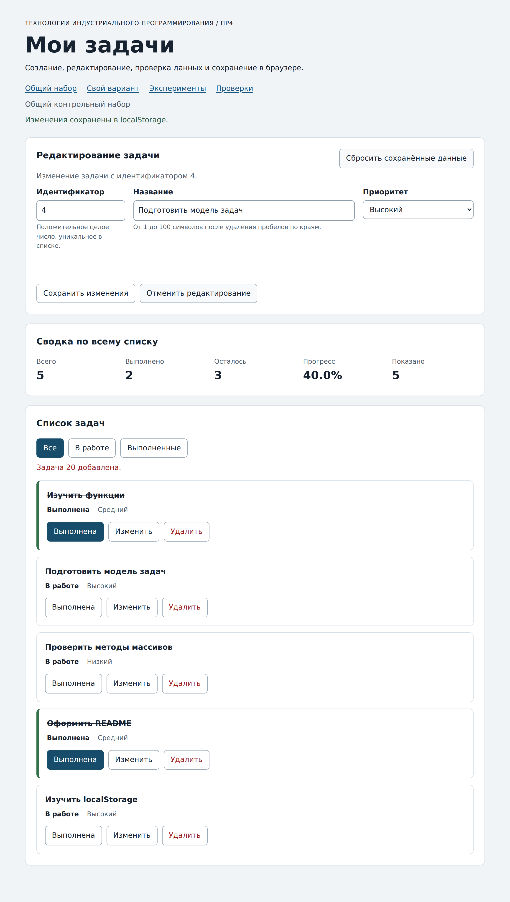

# Практическая работа № 4. Формы, валидация и локальное хранение данных

## Данные работы

| Поле | Значение |
|---|---|
| Имя | Никита Бочко |
| Группа | ЭФБО-05-25 |
| Вариант из ПР2-ПР3 | 3, создание сайта-портфолио |
| Node.js | v22.23.2 |
| Браузер | Chromium 141.0.7390.37 |
| Операционная система | macOS |

## Запуск

Рабочая папка: `practice-04` внутри личного репозитория.

```bash
npm test
npm start
```

`npm test` запускает подряд `check:service` и `check:modules`. Зависимостей нет, `npm install` не нужен. Адреса:

```text
http://127.0.0.1:5504/
http://127.0.0.1:5504/index.html?dataset=variant
http://127.0.0.1:5504/examples/forms-storage.html
http://127.0.0.1:5504/checks.html
```

## Перенос результата ПР3

Все четыре модуля перенесены из `practice-03` копированием, исправлять в них ничего не пришлось: `npm run check:service` на копии внутри ПР4 сразу дал 35 из 35.

| Файл | Что перенесено или изменено |
|---|---|
| `data.js` | Перенесён без изменений: общий набор и шесть задач варианта 3 |
| `task-service.js` | Перенесён и дополнен `updateTask`; внутренние проверки `checkId`, `normalizeTitle` и `checkPriority` переиспользованы |
| `task-selectors.js` | Перенесён `getVisibleTasks`; `getTasksByPriority` из расширения ПР3 убран, в ПР4 группы кнопок приоритета нет |
| `task-view.js` | Перенесён; в `createTaskElement` добавлена третья кнопка `edit` с подписью «Изменить» |

`main.js` из ПР3 не переносился: в стартовом комплекте ПР4 он уже содержит элементы формы, выбор ключа хранилища и готовые вспомогательные функции. Обработчики ПР3 перенесены в соответствующие места вручную.

## Эксперименты с формой и хранилищем

| № | До запуска: прогноз | После запуска: результат | Объяснение |
|---:|---|---|---|
| 1. Пустое обязательное поле | Сработает `submit`, обработчик покажет свою ошибку | `submit` не произошёл вовсе: журнал остался со строкой «Действия ещё не выполнялись», `validity.valueMissing` равен `true`, браузер показал своё сообщение `Please fill out this field.` | Браузер проверяет `required` до отправки и отменяет её, поэтому до обработчика дело не доходит. HTML-проверка стоит раньше прикладной |
| 2. Название из пробелов | Браузер тоже не пропустит | `submit` произошёл, `valueMissing` стал `false`, но `customError` равен `true`, сообщение `Название не должно состоять только из пробелов.`, в журнале «прикладная проверка отклонила значение» | Для `required` строка из пробелов не пустая, поэтому нативной проверки мало. Прикладное правило добавлено через `setCustomValidity` |
| 3. Типы значений `FormData` | Название придёт строкой, приоритет тоже | `submit.defaultPrevented: true`, `typeof FormData title: string`, сохранённое значение `{"title":"Изучить формы","priority":"low"}` | `FormData.get` всегда даёт строку, поэтому число из поля id надо приводить явно. `preventDefault` не даёт странице перезагрузиться, а `trim` убрал краевые пробелы уже в обработчике |
| 4. Строка в `localStorage` и JSON | `getItem` вернёт объект | `typeof localStorage value: string`; прочитанная строка `{"title":"Изучить формы","priority":"low"}`, после `JSON.parse` получился объект | В хранилище лежат только строки. Объект существует лишь после разбора, и именно поэтому схему надо проверять после `JSON.parse`, а не до |
| 5. Повреждённый JSON | Вернётся `null` или пустой объект | `JSON.parse завершился ошибкой: Expected property name or '}' in JSON at position 1`, сырое значение `{broken-json` осталось в ключе | Разбор выбрасывает исключение, и без `try/catch` оно уронило бы запуск приложения. Ключ при этом не самоочищается |

Отдельное наблюдение из третьего эксперимента: у учебного поля стоит `maxlength="20"`, и длинное название обрезалось ещё до `FormData`. Нативное ограничение молча меняет данные, а прикладная проверка сообщает о проблеме явно.

## Организация кода

`task-service.js` работает только с массивами задач: те же девять функций ПР2 плюс `updateTask`, который меняет `title` и `priority` выбранной записи и сохраняет `id` и `completed`. `form-validation.js` - чистая функция: получает черновик, текущий список и `editingId`, ничего не знает ни про `document`, ни про хранилище, и возвращает либо нормализованное значение, либо объект ошибок по полям. `task-storage.js` отвечает за схему сохранения, JSON и перехват исключений. `task-view.js` собирает DOM. `main.js` держит состояние (`currentTasks`, `currentFilter`, `editingId`), разбирает события и связывает всё вместе.

Функции хранения получают `storage` аргументом по двум причинам. Во-первых, так их можно проверить в Node.js, где никакого `localStorage` нет: в `modules.checks.js` подставляется объект-имитация `MemoryStorage`, и проверки 21, 24 и 26 подсовывают ему методы, которые бросают исключение. Во-вторых, зависимость видна в сигнатуре, а не спрятана внутри модуля.

Данные из JSON проверяются до использования, потому что содержимое `localStorage` может изменить кто угодно: сам пользователь через DevTools, расширение браузера или старая версия приложения с другой схемой. После `JSON.parse` это просто какой-то объект, и доверять ему нельзя. Поэтому `loadTasks` проверяет версию и прогоняет массив через `isValidTaskList`, а при любой неудаче возвращает независимую копию исходного набора с понятной ошибкой, а не пытается чинить данные.

## Проверка формы

| Сценарий | Ожидаемый результат | Фактический результат | Итог |
|---|---|---|---|
| Добавление корректной задачи | Задача в конце списка, данные сохранены | `id [1, 4, 7, 10, 20]`, в ключе те же пять id, название нормализовано до `Изучить localStorage` | Пройдено |
| Повторяющийся id | Отказ без изменения списка | `Задача с идентификатором 4 уже есть в списке`, `aria-invalid="true"` у поля id, в списке по-прежнему 5 карточек, новой записи нет | Пройдено |
| Пустое название | Отказ | Форма не отправилась, `title.validity.valueMissing` равен `true`, список не изменился | Пройдено |
| Название из пробелов | Отказ прикладной проверки | `submit` дошёл до обработчика, ошибка `Название не должно быть пустым` у поля названия, список не изменился | Пройдено |
| Название длиной 100 | Успех | Задача `id = 30` добавлена, длина названия в карточке 100 | Пройдено |
| Название длиной 101 | Отказ | Ошибка `Название длиннее 100 символов`, список остался прежним | Пройдено |
| Редактирование title и priority | Меняется одна задача, статус сохраняется | `id = 4` стала `Подготовить форму задач` с приоритетом «Низкий», статус остался «В работе» | Пройдено |
| Отмена редактирования | Возврат к пустой форме создания | Поле id разблокировано и пусто, название пусто, кнопка снова `Добавить задачу`, кнопка отмены скрыта | Пройдено |

## Общий сценарий

| Шаг | Действие | Видимые id | Всего | Выполнено | Осталось | Прогресс | Состояние storage |
|---:|---|---|---:|---:|---:|---:|---|
| 0 | Исходный запуск после сброса | `[1, 4, 7, 10]` | 4 | 2 | 2 | `50.0%` | ключа нет |
| 1 | Добавление `id = 20` | `[1, 4, 7, 10, 20]` | 5 | 2 | 3 | `40.0%` | записаны `1, 4, 7, 10, 20` |
| 2 | Отказ для повторного `id = 4` | `[1, 4, 7, 10, 20]` | 5 | 2 | 3 | `40.0%` | запись не изменилась |
| 3 | Редактирование `id = 4` | `[1, 4, 7, 10, 20]` | 5 | 2 | 3 | `40.0%` | записаны те же 5 id |
| 4 | Переключение `id = 7` | `[1, 4, 7, 10, 20]` | 5 | 3 | 2 | `60.0%` | записаны те же 5 id |
| 5 | Удаление `id = 1` | `[4, 7, 10, 20]` | 4 | 2 | 2 | `50.0%` | записаны `4, 7, 10, 20` |
| 6 | Перезагрузка страницы | `[4, 7, 10, 20]` | 4 | 2 | 2 | `50.0%` | «Данные восстановлены из localStorage.» |
| 7 | Сброс данных | `[1, 4, 7, 10]` | 4 | 2 | 2 | `50.0%` | ключа нет |

Совпало с контрольными значениями методички по всем восьми шагам. На шаге 2 сообщение появилось у поля id, список и запись в хранилище остались прежними. На шаге 3 статус задачи `4` остался `В работе`: `updateTask` меняет только название и приоритет. На шаге 7 ключ `tip-js-practice-04:demo` удалён и обратно не записан, то есть после сброса приложение работает на исходном наборе, но ничего не сохраняет до первого изменения.

## Проверка восстановления и ошибок

| Случай | Ожидание | Фактический результат | Итог |
|---|---|---|---|
| Записи нет | Используется независимая копия исходного набора | `source: "initial"`, строка состояния «Используется исходный набор; сохранённых данных пока нет», изменение полученного массива не задевает `demoTasks` (проверка 27) | Пройдено |
| Корректная запись | Данные восстанавливаются после перезагрузки | После перезагрузки `[4, 7, 10, 20]` и «Данные восстановлены из localStorage.» | Пройдено |
| Повреждённый JSON | Исходный набор и предупреждение | При значении `{broken-json` список `[1, 4, 7, 10]`, предупреждение `Сохранённые данные не прочитаны: Expected property name or '}' in JSON at position 1`, класс `is-warning` установлен | Пройдено |
| Неверная версия или схема | Исходный набор и предупреждение | `{"version":999,...}` и запись с `completed: "нет"` обе дали fallback с непустым предупреждением (проверки 19, 20 и браузерная «Некорректная схема из storage») | Пройдено |
| Сброс | Удаляется только ключ текущего набора | После сброса варианта ключ `tip-js-practice-04:variant` отсутствует, ключ общего набора не затронут; проверка 25 подтверждает, что `removeItem` вызывается один раз | Пройдено |
| Общий и индивидуальный наборы | Изменения не смешиваются | Изменения варианта не изменили общий набор; браузерная проверка разных ключей прошла | Пройдено |

## Индивидуальный вариант

Вариант 3, тема - создание сайта-портфолио. Исходные шесть задач: `11` собрать список работ (высокий, выполнена), `23` выбрать шаблон и цветовую схему (средний, выполнена), `37` свёрстать главную страницу (высокий), `41` добавить раздел с проектами (средний), `58` написать текст о себе (низкий), `64` опубликовать сайт на GitHub Pages (низкий).

Добавленная задача `id = 75` - «Настроить домен и favicon», приоритет `medium`. Задача `id = 23` переименована в «Выбрать шаблон, палитру и шрифтовую пару» с приоритетом `high`.

| Этап | Всего | Выполнено | Осталось | Прогресс | Видимые id |
|---|---:|---:|---:|---|---|
| Исходный набор | 6 | 2 | 4 | `33.3%` | `[11, 23, 37, 41, 58, 64]` |
| После добавления `75` | 7 | 2 | 5 | `28.6%` | `[11, 23, 37, 41, 58, 64, 75]` |
| После редактирования `23` | 7 | 2 | 5 | `28.6%` | `[11, 23, 37, 41, 58, 64, 75]` |
| После удаления `37` | 6 | 2 | 4 | `33.3%` | `[11, 23, 41, 58, 64, 75]` |
| После перезагрузки | 6 | 2 | 4 | `33.3%` | `[11, 23, 41, 58, 64, 75]` |
| После сброса | 6 | 2 | 4 | `33.3%` | `[11, 23, 37, 41, 58, 64]` |

Совпало с контрольными значениями: после добавления и удаления выполнены две задачи, итоговый прогресс при шести задачах `33.3%`. Карточка `23` после редактирования: «Выбрать шаблон, палитру и шрифтовую пару / Высокий / Выполнена», то есть статус не сбросился. Общий набор во время всех действий с вариантом остался `[1, 4, 7, 10]` с прогрессом `50.0%`, ключи у наборов разные.

## Протокол проверок сервиса

```text
OK: 01. Создание задачи с явным приоритетом
OK: 02. Приоритет по умолчанию
OK: 03. Удаление краевых пробелов без изменения внутренних
OK: 04. Граничные длины названия и положительный безопасный id
OK: 05. Некорректные названия при создании
OK: 06. Некорректные идентификаторы при создании
OK: 07. Все допустимые приоритеты и отклонение недопустимых
OK: 08. Каждый вызов createTask возвращает новый объект
OK: 09. Поиск по id, а не по индексу
OK: 10. Отсутствующая задача и пустой массив при поиске
OK: 11. Поиск не преобразует строковый id в число
OK: 12. Получение невыполненных задач
OK: 13. Пустой список, все выполнены и все не выполнены
OK: 14. Названия в исходном порядке и пустой список
OK: 15. Сводка по общему набору
OK: 16. Сводка по пустому списку
OK: 17. Сводка: ничего не выполнено и выполнено всё
OK: 18. Процент остаётся числом без предварительного округления
OK: 19. Добавление в конец без изменения входного массива
OK: 20. Добавление в пустой список с приоритетом по умолчанию
OK: 21. Повторяющийся id отклоняется
OK: 22. Добавление не обходит проверки createTask
OK: 23. Изменение completed в обе стороны
OK: 24. completed принимает только boolean
OK: 25. Некорректный или отсутствующий id при изменении статуса
OK: 26. Повторная установка статуса создаёт новый результат
OK: 27. Переименование сохраняет остальные поля
OK: 28. Проверки названия при переименовании
OK: 29. Некорректный или отсутствующий id при переименовании
OK: 30. Удаление по id с сохранением порядка
OK: 31. Удаление единственной записи
OK: 32. Некорректный, отсутствующий id и удаление из пустого списка
OK: 33. Входные объекты не изменяются ни одной операцией
OK: 34. Общий сценарий и все промежуточные сводки
OK: 35. Работа с другим набором, без зависимости от demoTasks

Проверок пройдено: 35; не пройдено: 0.
```

## Протокол проверок новых модулей

```text
OK: 01. updateTask изменяет название и приоритет выбранной задачи
OK: 02. updateTask нормализует название и сохраняет completed
OK: 03. updateTask не изменяет входной массив и объекты
OK: 04. updateTask отклоняет некорректный и отсутствующий id
OK: 05. updateTask отклоняет некорректные название и приоритет
OK: 06. Валидация создания нормализует поля
OK: 07. Валидация отклоняет некорректные id
OK: 08. Валидация отклоняет повторяющийся id при создании
OK: 09. Валидация проверяет название после trim
OK: 10. Валидация принимает только три приоритета
OK: 11. В режиме редактирования используется editingId
OK: 12. Редактирование отсутствующей задачи отклоняется
OK: 13. Валидация не изменяет draft и список
OK: 14. Проверка схемы принимает корректный список
OK: 15. Проверка схемы отклоняет неверную структуру
OK: 16. Отсутствующая запись возвращает независимую копию исходных данных
OK: 17. Корректная запись восстанавливается из хранилища
OK: 18. Повреждённый JSON приводит к безопасному fallback
OK: 19. Неизвестная версия приводит к безопасному fallback
OK: 20. Некорректные задачи из JSON не принимаются
OK: 21. Ошибка getItem перехватывается
OK: 22. Сохранение записывает версию и задачи
OK: 23. Некорректный список не записывается
OK: 24. Ошибка setItem перехватывается
OK: 25. Удаляется только переданный ключ
OK: 26. Ошибка removeItem перехватывается
OK: 27. Результат загрузки не разделяет объекты с fallback

Проверок пройдено: 27; не пройдено: 0.
```

## Протокол браузерных проверок

```text
OK: Фильтры ПР3 сохраняют порядок и не изменяют вход
OK: Карточка содержит toggle, edit и delete
OK: Название задачи выводится как текст
OK: Повторная отрисовка списка не накапливает карточки
OK: Сводка использует полный список и отдельный visibleCount
OK: Пустые состояния различают список и фильтр
OK: Приложение запускается с исходным набором
OK: Корректная форма добавляет задачу и сохраняет данные
OK: Повторяющийся id отклоняется без записи
OK: Название из пробелов отклоняется прикладной проверкой
OK: Нативные ограничения не пропускают пустую форму
OK: Кнопка edit заполняет форму и блокирует id
OK: Редактирование меняет title и priority, сохраняя completed
OK: Отмена редактирования возвращает режим создания
OK: Успешная отправка очищает ошибки и форму
OK: Изменение статуса сохраняется
OK: Удаление сохраняется
OK: Фильтр не записывается, но сохраняется после изменения данных
OK: Перезагрузка восстанавливает сохранённые задачи
OK: Сброс удаляет ключ и восстанавливает исходный набор
OK: Повреждённый JSON не ломает запуск
OK: Некорректная схема из storage заменяется исходным набором
OK: Общий и индивидуальный наборы используют разные ключи

Всего: 23. Пройдено: 23. Ошибок: 0.
```

## Собственные проверки

| № | Исходное состояние и действия | Ожидаемый результат | Фактический результат | Итог |
|---:|---|---|---|---|
| 1. Граница формы: названия длиной 100 и 101 | После сброса добавить `id = 30` с названием из 100 символов, затем `id = 31` с названием из 101 символа | Первая задача создаётся, вторая отклоняется с сообщением у поля названия | `id [1, 4, 7, 10, 30]`, длина названия в карточке 100; второй вызов дал `Название длиннее 100 символов`, список не изменился | Пройдено |
| 2. Восстановление после перезагрузки с открытым редактированием | Изменить `id = 4` через форму, затем нажать «Изменить» у `id = 7` и перезагрузить страницу | Данные восстанавливаются, форма открывается в режиме создания: режим редактирования не сохраняется | После перезагрузки список и сводка совпали с состоянием до неё, строка состояния «Данные восстановлены из localStorage.», форма в режиме создания, поле id разблокировано | Пройдено |
| 3. Повреждение хранилища вручную | После сброса записать в ключ `tip-js-practice-04:demo` строку `{broken-json` и обновить страницу, затем нажать сброс | Приложение запускается на исходном наборе с предупреждением, сброс убирает повреждённое значение | Список `[1, 4, 7, 10]`, сводка `4 / 2 / 2 / 50.0%`, предупреждение с текстом ошибки разбора и классом `is-warning`; после сброса ключ отсутствует, предупреждение снято | Пройдено |
| 4. Недоступное хранилище | Подставить объект, у которого `getItem`, `setItem` и `removeItem` бросают исключение | Ни одна функция не выпускает исключение наружу, возвращается `ok: false` с сообщением | Проверки 21, 24 и 26 из `check:modules` прошли: чтение дало fallback с исходным набором, запись и удаление вернули отказ | Пройдено |

Второй случай оказался полезнее, чем ожидалось: `editingId` живёт только в памяти модуля, поэтому перезагрузка во время редактирования всегда возвращает форму в режим создания. Данные при этом на месте, потому что они сохраняются после каждой успешной операции, а не при закрытии страницы.

## Отладка и клавиатура

Точка останова ставится в `handleFormSubmit` на строке `const validation = validateTaskDraft(draft, currentTasks, editingId);`. При добавлении задачи с id `20` и названием `  Изучить localStorage  ` в Scope видно:

- сырой черновик: `{ id: "20", title: "  Изучить localStorage  ", priority: "high" }` - все три значения строки, потому что пришли из `FormData`;
- `editingId` равен `null`, то есть режим создания;
- результат валидации: `{ ok: true, value: { id: 20, title: "Изучить localStorage", priority: "high" } }` - id уже число, название нормализовано;
- результат сервиса: `addTask` вернул `{ ok: true, tasks: [...] }` с пятью записями, исходный массив остался с четырьмя;
- записанная строка: `{"version":1,"tasks":[{"id":1,...},{"id":20,"title":"Изучить localStorage","completed":false,"priority":"high"}]}`.

Ошибочный сценарий с повторным id прослеживается так же: черновик `{ id: "4", title: "Дубликат", priority: "low" }`, валидация возвращает `{ ok: false, errors: { id: "Задача с идентификатором 4 уже есть в списке" } }`, до `addTask` дело не доходит, `currentTasks` не переприсваивается и `saveTasks` не вызывается. В интерфейсе это видно по `aria-invalid="true"` у поля id и неизменному количеству карточек.

Клавиатура: Tab проходит по ссылкам шапки, кнопке сброса, трём полям формы, кнопкам формы, фильтрам и дальше по трём кнопкам каждой карточки. Enter в поле названия отправляет форму - задача `id = 50` добавилась без мыши. Enter на кнопке «Изменить» переводит форму в режим редактирования, и фокус уходит в поле названия (`document.activeElement.id` равен `task-title`), подпись кнопки меняется на «Сохранить изменения». Space на кнопке «Отменить редактирование» возвращает режим создания: фокус переходит в поле id, поле снова доступно, подпись кнопки «Добавить задачу». Enter на кнопке «Удалить» у `id = 7` удаляет задачу, и, поскольку карточка исчезла, `restoreTaskFocus` переводит фокус на активную кнопку фильтра «Все».

## Вид приложения



Снимок сделан после добавления задачи `id = 20` и нажатия «Изменить» у задачи `id = 4`: заголовок панели сменился на «Редактирование задачи», поле идентификатора заблокировано, кнопка подписана «Сохранить изменения», рядом появилась отмена, а строка состояния сообщает о записи в localStorage.

## Дополнительное задание

Выполнен **вариант А - черновик формы**, модуль [`src/form-draft.js`](./src/form-draft.js).

Правила. Черновик хранится под собственным ключом `tip-js-practice-04:<набор>:draft`, отдельно от задач, и под той же схемой с версией: `{ version: 1, draft: { id, title, priority } }`. Сохраняется при каждом событии `input` в форме и только в режиме создания: в режиме редактирования запись не выполняется, чтобы чужие правки не подменяли незаконченную новую задачу. Если оба текстовых поля пусты, ключ удаляется, а не хранит пустую запись. Черновик удаляется после успешного добавления, после сброса данных и при повреждении. Восстановленный черновик заполняет поля, но не считается созданной задачей: пока форма не отправлена, в списке ничего нет.

Отдельно оговорена привязка к сохранённому состоянию: черновик восстанавливается только тогда, когда у набора есть сохранённые задачи. Если ключа задач нет (первый запуск или только что выполненный сброс), черновик прошлой сессии удаляется. Иначе пришлось бы писать в ключ задач при первом же нажатии клавиши, а это нарушило бы правило «неудачная форма ничего не сохраняет».

| № | Действия | Ожидаемый результат | Фактический результат | Итог |
|---:|---|---|---|---|
| 1 | Заполнить `id = 33` и название «Недописанная задача», форму не отправлять, перезагрузить страницу | Поля восстановлены, в списке новой задачи нет | Поля `id="33"`, `title="Недописанная задача"`, `priority="high"`; в ключе черновика `{"version":1,"draft":{"id":"33","title":"Недописанная задача","priority":"high"}}`; список без задачи 33 | Пройдено |
| 2 | Дозаполнить форму и успешно добавить задачу | Черновик удаляется, форма пуста | Поля пусты, приоритет вернулся к `medium`, ключ черновика равен `null` | Пройдено |
| 3 | Записать в ключ черновика строку `{broken` и перезагрузить | Форма открывается пустой, показано сообщение, повреждённый ключ удаляется | Поля пусты, сообщение `Черновик формы не прочитан: Expected property name or '}' in JSON at position 1`, ключ черновика равен `null` | Пройдено |
| 4 | Нажать «Изменить» у задачи и править название | Черновик не записывается: режим редактирования его не трогает | После правки названия в режиме редактирования ключ черновика остался `null` | Пройдено |

## Вывод

ПР4 достроила недостающую половину приложения: в ПР3 данные можно было только менять готовыми кнопками, теперь их создают и редактируют через форму, а результат переживает перезагрузку. Переносить пришлось четыре модуля, и ни один не потребовал правок - регрессия 35 из 35 прошла сразу, что для меня главный аргумент в пользу того, что логику и интерфейс в ПР2 и ПР3 развели правильно.

Главное, что стало понятно, - три проверки данных стоят на разных уровнях и не заменяют друг друга. Нативная HTML-проверка (`required`, `type="number"`, `maxlength`) отсекает очевидное до отправки формы, работает быстро, но её правила грубые: строка из пробелов для `required` вполне заполнена, а `maxlength` молча обрезает значение. Прикладная валидация в `validateTaskDraft` знает правила модели: положительный безопасный целый id, уникальность в списке, название от 1 до 100 после `trim`, три приоритета. Третий уровень - проверка данных, прочитанных из `localStorage`: там лежит строка, которую мог изменить кто угодно, поэтому после `JSON.parse` массив прогоняется через `isValidTaskList`, и при любом несовпадении берётся исходный набор с предупреждением, а не «почти подходящие» данные.

Ошибок в реализации не было, все три набора проверок (35, 27 и 23) прошли с первого запуска. Самым неочевидным местом оказалось расширение: черновик хочется сохранять на каждое нажатие клавиши, но запись при незавершённой форме конфликтует с требованием «неудачная отправка ничего не сохраняет». Развязал это отдельным ключом и привязкой времени жизни черновика к сохранённым задачам.

## Самопроверка

- [x] ПР4 лежит в личном репозитории рядом с предыдущими работами, они не изменены.
- [x] Четыре модуля перенесены из ПР3, регрессия сервиса 35 из 35.
- [x] Реализованы `updateTask`, `validateTaskDraft` и четыре функции хранения, заглушек не осталось.
- [x] Форма поддерживает создание и редактирование, ошибки связаны с полями.
- [x] Операции сохраняются, перезагрузка восстанавливает данные, сброс удаляет только свой ключ.
- [x] Повреждённые данные и исключения хранилища не роняют запуск.
- [x] `check:modules` 27 из 27, браузерные проверки 23 из 23.
- [x] Пройдены пять экспериментов, общий сценарий и индивидуальный вариант.
- [x] Выполнены собственные проверки: граница формы, восстановление, повреждение хранилища.
- [x] Выполнено дополнительное задание с четырьмя проверками.
- [ ] Код и отчёт отправлены в учебный репозиторий.
